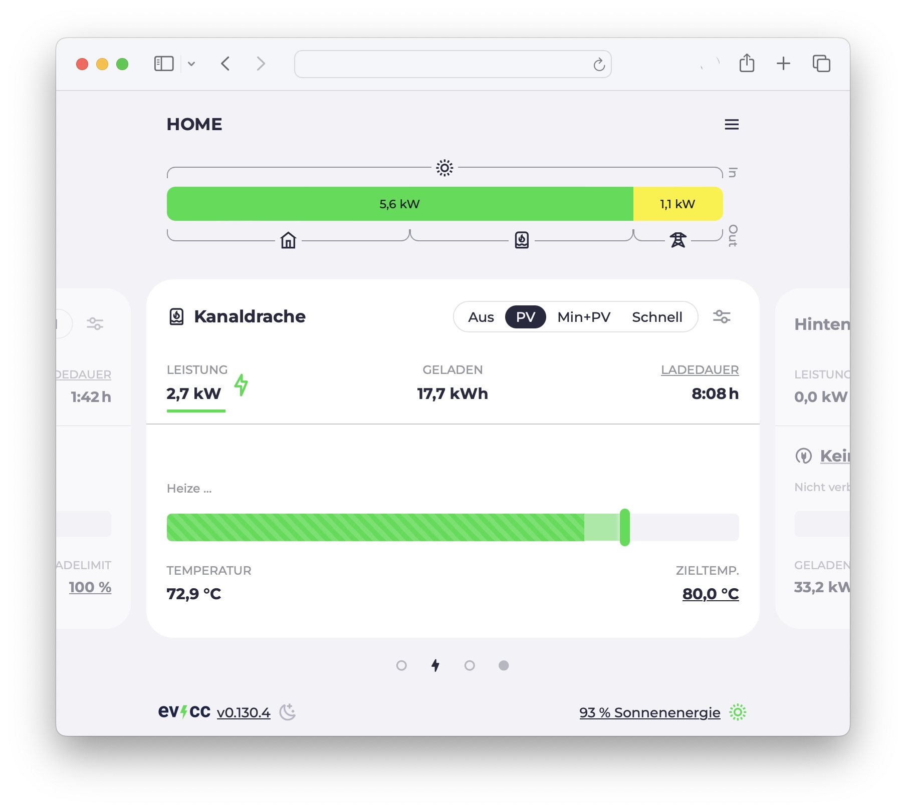
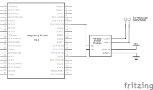

# ATON Control


**Stufenlose Heizstabregelung über PWM**

Dies ist eine Anleitung zur stufenlosen Regelung eines [TA EHS-R Heizstabs 3000W (ATON)](https://www.ta.co.at/x2-energiemanagement/heizstab-3000-w-stufenlos-regelbar) über PWM.
Die Software stellt die Schnittstellen bereit die für eine PV-Überschussregelung durch [evcc](https://evcc.io) benötigt werden.

_**Disclaimer:** Dieses Repository ist als Inspiration und Anleitung gedacht.
Es beschreibt mein privates Projekt und ist daher an meine spezifische Installation angepasst.
Es gibt keine Pläne die Software zu generalisieren.
Aber gerne kopieren und an eigene Bedürfnisse anpassen._

## Systemübersicht


### Heizstab und Pufferspeicher

Der Heizstab ist an einem Pufferspeicher/Schichtspeicher angeschlossen.
Die Wärme wird in meinem Fall sowohl für die Warmwasserbereitung als auch für die Heizung genutzt.
Temperaturinformationen der unterschiedlichen Bereiche des Speichers werden über die [vorhandene Regelung](https://www.ta.co.at/x2-frei-programmierbare-regler) ausgelesen.

### ATON CTRL

Die `aton-ctrl` Anwendung (dieses Repository) dient als Schnittstelle zwischen evcc und dem Heizstab.
Richtung evcc stellt sie eine REST-Schnittstelle bereit.
Über diese kann der Status des Heizstabs abgefragt und die Leistung eingestellt werden.
Richtung Heizstab wird die Leistung über 12V PWM geregelt.

### PV-Überschussregelung mit evcc

Die [evcc](https://evcc.io) Anwendung kennt die aktuelle Energiebilanz des Hauses und steuert neben der Wallbox auch den Heizstab.



### Energiemessung (optional)

Energie- und Leistungsmessung erfolgt über einen separaten Zähler.
In meinem Fall ein [Shelly Pro 1PM](https://www.shelly.com/de/products/shop/shelly-pro-1pm).
Das Relais des Shelly wird bei mir nicht verwendet.
Die Regelung erfolgt über die PWM-Schnittstelle.
Der Zähler ist nicht zwingend notwendig, aber hilfreich um die tatsächlich verbrauchte Energie zu messen.
Ohne Zähler trifft evcc die Annahme, dass die freigegebene Leistung auch tatsächlich in Anspruch genommen wird.

### PWM Signal

Der PWM-Eingang des Heizstabs erwartet ein 400 Hz - 4 kHz Signal mit 9 - 13 V ([Datenblatt](https://www.ta.co.at/download/datei/3456#page=14)).
Über die GPIO-Pins eines Raspberry Pi können nur 3.3V ausgegeben werden.
Daher wird das Raspberry-Signal über ein [Mosfet-Modul](https://www.amazon.de/Treibermodul-Dual-Hochleistungs-Switching-Schalttafel-Ar-duino/dp/B0CGVB651Z) und eine 12 V Spannungsquelle verstärkt.



## Software

`aton-ctrl` ist in Go geschrieben und läuft als Systemd-Service auf einem Raspberry Pi.

Das Programm liest beim Start die Zieltemperatur und einen Offset (für die Hysterese) aus einer Konfigurationsdatei `aton.json`.

```json
{
  "enableOffset": 2,
  "maxTemp": 73.0
}
```

In diesem Beispiel wird die Zieltemperatur auf 73°C gesetzt.
Ist diese erreicht, wird der Heizstab abgeschaltet.
Der Offset von 2°C bedeutet, dass der Heizstab erst wieder eingeschaltet wird, wenn die Temperatur auf 71°C gefallen ist.

Die aktuelle Wassertemperatur wird aus der Datei `temp.txt` gelesen.
Diese wird von einem anderen Prozess regelmäßig aktualisiert.

Über den Endpunkt `/state` kann der aktuelle Status des Heizstabs abgefragt werden.

```
GET /state

{
  "enabled": true,
  "current": 13,
  "watt": 0,
  "pwm": 10,
  "temp": 72.9,
  "enableOffset": 2,
  "maxTemp": 73,
  "heating": false,
  "status": "B"
}
```

Der Heizstab besitzt keine eigene Temperatureinstellung.
Lediglich ein Überhitzungsschutz ist vorhanden.
Dieser versetzt das Gerät in einen Fehlerzustand.
Daher ist eine zusätzliche Temperaturüberwachung und -begrenzung notwendig.

### Software bauen

Go muss auf dem eigenen Rechner installiert sein.
Das Programm kann dann mit `go build` gebaut werden.

```bash
go build
```

Danach kann das Binary ausgeführt werden.

```bash
./aton-ctrl
```

Durch Go's Cross-Compilation kann das Binary auch auf einem anderen System gebaut werden.
Der folgende Befehl erstellt ein ARM-Binary für den Raspberry Pi Zero.

```bash
env GOOS=linux GOARCH=arm GOARM=5 go build
```

## evcc Konfiguration

Hier ein Auszug aus der `evcc.yaml` um den Heizstab zu steuern.
Der `aton-ctrl` Service läuft hier im Netzwerk unter `192.168.1.3:3000`.
Der Stromstärkenbereich (0.25 A bis 13 A) wird über die UI am Ladepunkt eingestellt.

```yaml
meters:
  - name: heizstab
    type: template
    template: shelly-1pm
    usage: charger
    host: 192.168.1.2

chargers:
  - name: aton-ctrl
    icon: waterheater
    type: custom
    enable:
      source: http
      method: POST
      uri: http://192.168.1.3:3000/enable
    enabled:
      source: http
      method: GET
      uri: http://192.168.1.3:3000/state
      jq: .enabled
    status:
      source: http
      method: GET
      uri: http://192.168.1.3:3000/state
      jq: .status
    maxcurrent:
      source: http
      method: POST
      uri: http://192.168.1.3:3000/current
    maxcurrentmillis:
      source: http
      method: POST
      uri: http://192.168.1.3:3000/current
    soc:
      source: http
      uri: http://192.168.1.3:3000/state
      jq: .temp
    features: [integrateddevice, heating]

loadpoints:
  - title: Wasserspeicher
    charger: aton-ctrl
    meter: heizstab
    mode: pv
    priority: 0 # low priority, cars first
    enable:
      delay: 5m
    disable:
      delay: 5m
```
